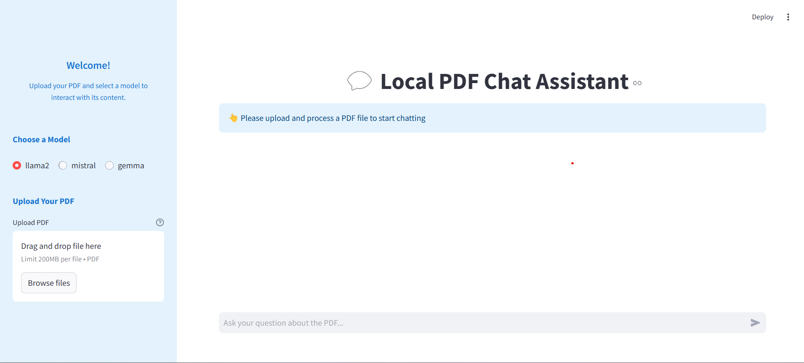

Introduction
============

Welcome to the **Local PDF Chat Assistant** documentation! This application is designed to revolutionize the way users interact with PDF documents by leveraging the power of natural language processing (NLP) and advanced AI models. It provides a seamless interface for querying and exploring PDF content efficiently and intuitively.

### Overview

The Local PDF Chat Assistant allows users to:
- **Upload PDF Files**: Users can upload PDF documents to extract and process content.
- **Ask Contextual Questions**: Through an interactive chat interface, users can pose questions related to the uploaded PDF, and the application provides accurate, context-aware responses.
- **View Sources**: Responses generated from the PDF include source references, ensuring traceability and transparency.

This application is built with a focus on user experience, enabling easy access to document information without manually searching through pages.

---

### Streamlit Interface

The application provides an intuitive interface for uploading PDFs, selecting models, and querying documents. Below is an example of the interface:

### Key Features

1. **Interactive PDF Chat**:
   - Upload a PDF and start asking questions in plain language.
   - The app understands the context and retrieves relevant answers from the document.

2. **Model Selection**:
   - Choose between different AI models (e.g., `llama3`, `mistral`, `gemma`) based on your preference or computational needs.

3. **Source-Based Responses**:
   - Get answers that are backed by the exact source from the document for credibility and validation.

4. **Optimized PDF Processing**:
   - Utilizes the LangChain library for text segmentation and FAISS for efficient vector storage and retrieval.

5. **Streamlit User Interface**:
   - A simple, intuitive interface for uploading PDFs, selecting models, and querying the document.

---

### How It Works

1. **PDF Upload and Processing**:
   Users upload a PDF via the sidebar.  
   The application processes the file using advanced text splitting techniques to extract and structure the content into manageable chunks.

2. **Embedding and Vector Storage**:
   The extracted chunks are embedded using a selected AI model, and a vector store (FAISS) is created for efficient document retrieval.

3. **Interactive Chat**:
   Users type questions in the chat interface.  
   The app retrieves the most relevant chunks, generates a response, and displays it with the corresponding source references.

4. **Model Flexibility**:
   Switch between supported AI models to optimize for performance or specificity.

---

### Use Cases

The Local PDF Chat Assistant is versatile and can be used in various scenarios:
- **Research and Study**:  
  Extract information from academic papers or books without manually skimming through pages.
- **Business and Legal**:  
  Quickly find specific clauses or terms in lengthy contracts and agreements.
- **Data Analysis**:  
  Analyze reports or data-heavy documents by querying specific sections.

---

### Technology Stack

The Local PDF Chat Assistant is powered by:
- **Streamlit**: For the user interface and real-time interactivity.
- **LangChain**: For text splitting, embeddings, and conversational AI chains.
- **FAISS**: For efficient vector-based search and retrieval.
- **Ollama Models**: State-of-the-art NLP models for embedding and querying.

---

This documentation will guide you through the installation, usage, and configuration of the Local PDF Chat Assistant. Dive into the sections below to learn how to get started!
